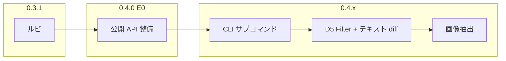

# hpdft 0.3.1 / 0.4 ロードマップ

`master` @ 0.3.0.0（2026-07-05）以降の方針。

## リリース方針

| 版 | 位置づけ | 主な内容 |
|----|---------|---------|
| **0.3.1** | 0.3 の拡張 | ルビ抽出（青空文庫記法） |
| **0.4.0** | API 基盤 | E0 公開 API 整備 |
| **0.4.x** | 機能拡張 | D7 → D5+E2 → E3（順次） |

0.3 残タスク（D2–D7）は **0.4 目標との関連で取捨選択** する。下記「0.3 残タスクの扱い」参照。

---

## 0.3.1 — ルビ抽出

0.4 API 整備とは独立して進められる。Layout / Interpret の延長として **0.3.1 で先行リリース** する。

### 出力形式（青空文庫）

[青空文庫 注記一覧・ルビ](https://www.aozora.gr.jp/annotation/etc.html) に準拠。

| ケース | 出力例 |
|--------|--------|
| 単一文字種の基底 | `青空文庫《あおぞらぶんこ》` |
| 混在文字種の基底 | `霧の｜ロンドン警視庁《スコットランドヤード》` |

- ルビ本体は `《…》`（全角括弧）
- 基底が漢字・仮名・英字など **複数文字種混在** するときは基底直前に `｜`（全角縦棒）を付ける
- 平仮名と片仮名は別文字種として扱う（青空文庫マニュアル準拠）
- **0.3.1 の MVP** は上記の横書き・縦書き geometry ヒューリスティック + Structure パス。左付きルビ・ママ注記・外字注記は **注記形式**（`［＃…］`）として後回し可

### 抽出パイプライン（優先順）

```
Structure（/Ruby, /RB, /RT 等が利用可能）
  ↓ 不可・不完全
geometry ヒューリスティック（Layout 拡張）
```

- **Tagged PDF に Ruby 構造がある場合は Structure パスを優先**（MCID 紐付けと同様の方針）
- geometry フォールバック:
  - 横書き (wmode 0): 親行の直上、小字体、親文字 span と X 範囲が重なる行
  - 縦書き (wmode 1): 親列の右側、小字体、親文字 span と Y 範囲が重なる行
- 脚注・上付き処理（`--footnotes`）と競合しないよう、**ルビ行の分離を脚注処理より前** に行う
- CLI: 既存テキスト抽出に `--ruby` を追加（既定 off）。有効時は行内に青空記法を埋め込む

### 0.3.1 で触るモジュール（想定）

- `PDF.Structure` — Ruby 要素の解析・MCID/座標との対応
- `PDF.Layout` — ルビ行検出・基底への結合、`aozoraRuby` 整形（`｜` 判定含む）
- `PDF.Text` — `--ruby` 配線
- `hpdft.hs` — フラグ追加
- `test/Unit.hs` — synthetic glyph 配置の unit テスト

### 0.3.1 スコープ外

- 左付きルビ（青空の `［＃…の左に…］` 注記形式）
- 外字・長基底の開始/終了型注記
- wmode 混在ページの interleave（既知制限のまま）

---

## 0.4 — 全体像



**作業順（合意）:** E0 → D7 → D5+E2 → E3

D2（CI）は E0 と並行または直後。API とテスト基盤が整うと E2 の fixture 化が容易になる。

---

## E0 — ライブラリ API 整備（0.4.0）

`scripts/` が `DocumentStructure` 内部関数に直接依存している状態を解消し、**安定した公開境界** を設ける。

### 目標 API（案）

```haskell
-- PDF.Page（新規）
pageCount     :: Document -> PdfResult Int
pageRefAt     :: Document -> Int -> PdfResult PageRef   -- 1-based
pageItems     :: Document -> PageRef -> PdfResult [PageItem]
pageGlyphs    :: Document -> PageRef -> PdfResult [Glyph]
pageLines     :: Document -> PageRef -> LayoutOptions -> PdfResult [Line]
pageParagraphs :: Document -> PageRef -> LayoutOptions -> PdfResult [T.Text]

-- 構造化出力（diff 共用）
data PageRegion = PageRegion
  { regionPage      :: Int
  , regionParagraph :: Int      -- ページ内段落番号
  , regionBBox      :: Rect     -- 段落 bbox 概算
  , regionText      :: T.Text
  }

pageRegions :: Document -> PageRef -> LayoutOptions -> PdfResult [PageRegion]
```

- `interpret-page` / `inspect_font` / 将来の `diff` が **公開 API のみ** で書けるようにする
- `hpdft.cabal` の `exposed-modules` を明示的に整理
- breaking change は 0.4.0 で一括（CHANGELOG に移行ガイド）

---

## D7 — CLI サブコマンド化

フラグ連鎖を廃止し、サブコマンドで整理。

```
hpdft extract [OPTIONS] FILE          # テキスト（現行 default）
hpdft extract text [OPTIONS] FILE     # 明示的テキスト
hpdft extract images -p PAGE FILE     # E3: 画像書き出し
hpdft diff FILE_A FILE_B              # E2: 段落 diff
hpdft inspect page FILE PAGE          # interpret-page 相当
hpdft info FILE                       # メタデータ
```

- 0.3 の `-p`, `--geom`, `--legacy`, `--ruby` 等は `extract` サブコマンド配下へ
- 旧フラグ形式は **1 版 deprecated 警告** のうえ互換維持を検討

---

## E2 — テキスト diff（段落単位）

### 粒度

**段落単位**。ページ番号 + ページ内段落 index + bbox 概算で「どこが変わったか」を返す。

### 設計

```haskell
data TextChange
  = TextChange
    { changePageA      :: Maybe Int
    , changePageB      :: Maybe Int
    , changeParaA      :: Maybe Int
    , changeParaB      :: Maybe Int
    , changeBBox       :: Maybe Rect
    , changeOld        :: T.Text
    , changeNew        :: T.Text
    }
  | PageCountMismatch { pagesA :: Int, pagesB :: Int }

compareDocuments :: LayoutOptions -> Document -> Document -> PdfResult [TextChange]
```

- 各ページを `layoutPageText` / `pageParagraphs` で段落列に分解（**document-level 結合は diff では使わない**）
- 正規化（空白・ヘッダ除去は LayoutOptions で制御）後、段落列の LCS
- CLI: `hpdft diff a.pdf b.pdf [--json]`
- ライブラリファースト。CLI は薄いラッパー

---

## E3 — 画像抽出

### 意図する挙動

```bash
hpdft extract images -p 3 FILE.pdf -o ./out/
# → FILE.pdf 3 ページ目の Image XObject を out/page3-001.jpg 等として書き出す
```

- **ファイル書き出しが本体**。bbox はファイル名や sidecar JSON に付随させる程度
- `/Image` XObject の stream を Filter に応じてデコードし、JPEG はそのまま `.jpg`、raw/Flate は PNG 化または raw 保存
- Form XObject 内のネスト画像は **再帰追跡**（Interpret の XObject 走査を拡張）
- インライン画像は 0.4.x 後半または 0.5 候補
- **D5 前提:** 最低限 `/DCTDecode`（JPEG）。Flate+PNG predictor は既存。LZW 等はコーパス需要に応じて追加

---

## 0.3 残タスクの扱い

| ID | 0.4 関連 | 判断 |
|----|---------|------|
| **D2** CI | E0/E2 のテスト自動化 | E0 前後で導入。0.3.1 ルビ PR から optional で可 |
| **D3** パーサ統一 | なし | **延期**（痛みが出たら） |
| **D5** Filter | E3 必須（DCTDecode） | **E3 直前に DCTDecode を先行**。LZW/ASCII85 は後追い |
| **D6** AES-256 | 暗号化 PDF 対象時 | コーパス次第。**0.4 スコープ外可** |
| **D7** CLI | E2/E3 の CLI | **E0 直後**（合意順序） |

0.3 フォローアップ:

| 項目 | 判断 |
|------|------|
| MediaBox 外フィルタ | E2/diff ノイズ削減のため **E0〜E2 で検討** |
| wmode 混在 interleave | **0.3.1 ルビでは既知制限のまま** |
| RTL / 行内逆順 | スコープ外継続 |

---

## 推奨マイルストーン

| 順 | 版 | 内容 | 状態 |
|----|-----|------|------|
| 1 | **0.3.1** | ルビ（Structure 優先 → geometry、`--ruby`、青空記法） | **完了** v0.3.1.0 |
| 2 | **0.4.0** | E0 公開 API + exposed-modules 整理 | **完了** |
| 3 | **0.4.0/1** | D2 CI（並行可） | **完了** v0.4.4.0 |
| 4 | **0.4.1** | D7 CLI サブコマンド | **完了** |
| 5 | **0.4.2** | D5（DCTDecode）+ E2 段落 diff | **完了** |
| 6 | **0.4.3** | E3 `extract images` | **完了** v0.4.3.0 |

---

## 参照

- [青空文庫 ルビとルビのように付く文字](https://www.aozora.gr.jp/annotation/etc.html)
- [0.3 ロードマップ](0.3-roadmap.md) — 0.3.0.0 までの完了内容
